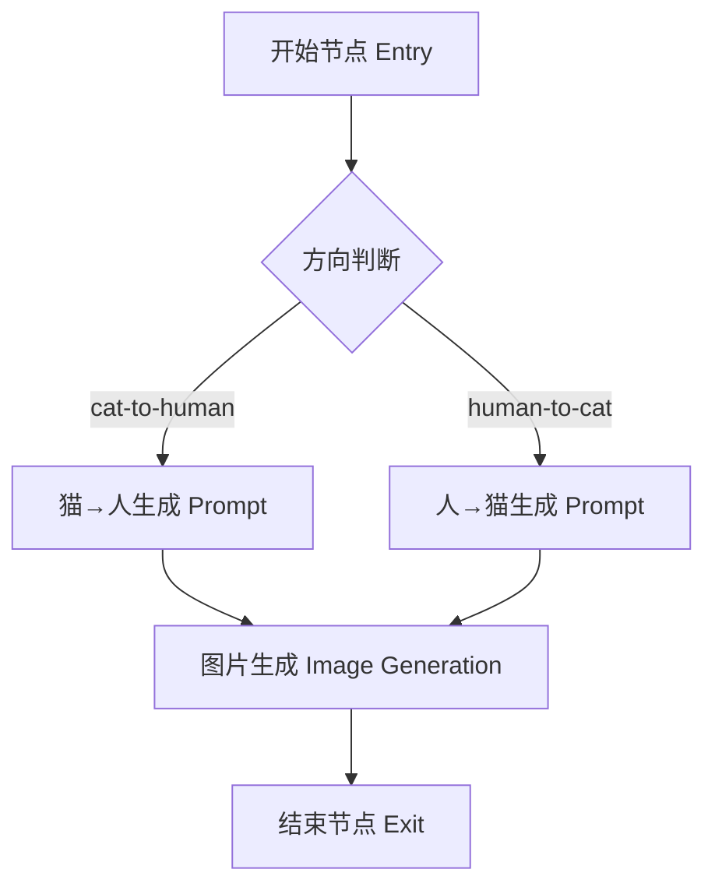
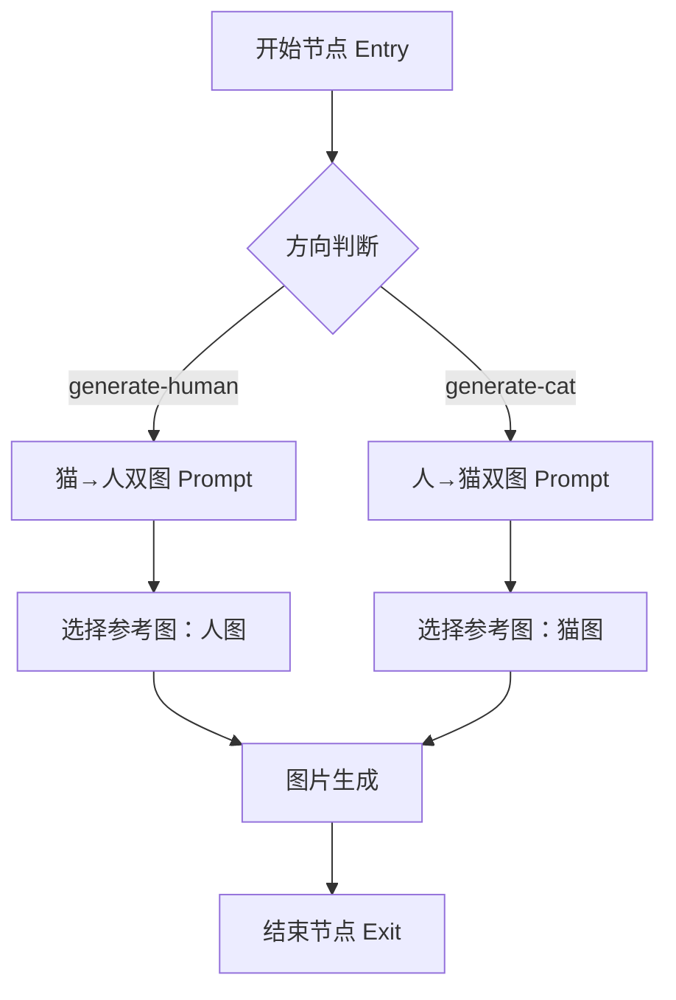

# 人猫替换 - Coze 工作流设计

## 概述

本文档定义了两个 Coze 工作流的设计：**单图模式** 和 **双图模式**。
server.js 保持 SDK 模式不变，工作流作为可视化方案在 Coze 平台上创建。

---

## 工作流 1：单图模式（human-beast-swap-single）

### 流程图



### 输入参数

| 参数名 | 类型 | 必填 | 说明 |
|--------|------|------|------|
| image_url | String | 是 | 用户上传的图片 URL |
| direction | String | 是 | 方向：`cat-to-human` 或 `human-to-cat` |

### 输出参数

| 参数名 | 类型 | 说明 |
|--------|------|------|
| result_image_url | String | 生成的替换图片 URL |

### 节点配置

#### 节点 1：Entry（开始节点）

- 输入变量：
  - `image_url`（String）：源图片 URL
  - `direction`（String）：替换方向

#### 节点 2：条件判断（If/Else）

- 条件：`{{direction}}` == `cat-to-human`
- True 分支 → 猫→人 Prompt 节点
- False 分支 → 人→猫 Prompt 节点

#### 节点 3a：猫→人 Prompt（Code 节点）

```javascript
async function main({ direction }) {
  const prompt = `将参考图中的猫咪1:1替换为病娇小少妇，严格还原猫咪的姿势动作和神情。猫咪歪头半眯眼→她头微微歪向一侧，眼皮半耷拉半眯，眼神慵懒空洞又带一丝满足；猫咪嘴里含吸管喝冰美式→她嘴唇含白色吸管，吸管插在透明塑料杯的深褐色冰美式里，杯中冰块清晰；猫咪前爪搭桌上→她的手随意搭在浅棕色木纹桌面上；猫咪脖子挂工牌→她脖子挂工牌绳，工牌证件照是穿正装的二次元萝莉动漫角色大头照（蓝底标准证件照排版）。25岁少妇，苍白皮肤，黑微卷长发，病娇气质，白衬衫微敞，黑包臀裙，桌上键盘旁立萝莉手办，领口别萝莉胸针。灰色工位背景虚化。写实摄影电影画质伦勃朗光3:4竖构图。`;
  return { prompt };
}
```

#### 节点 3b：人→猫 Prompt（Code 节点）

```javascript
async function main({ direction }) {
  const prompt = `将参考图中的人物1:1替换为一只猫，严格还原人物的姿势动作和神情。人物歪头半眯眼→猫咪歪头半眯眼慵懒空洞；人物含吸管喝冰美式→猫咪嘴里含白色吸管，吸管插在透明塑料杯冰美式里，杯中冰块清晰；人物手搭桌上→猫咪前爪搭浅棕色木纹桌面；人物脖子挂工牌→猫咪脖子挂工牌绳，工牌证件照是猫咪穿正装照片。胖橘白相间猫咪，粉鼻头，白色胡须，慵懒满足。灰色工位背景虚化。写实摄影电影画质3:4竖构图。`;
  return { prompt };
}
```

#### 节点 4：图片生成（Image Generation 节点）

- 模型：Coze 图片生成模型
- Prompt：引用上游条件分支输出的 `{{prompt}}`
- 参考图：`{{image_url}}`（来自 Entry 节点）
- 尺寸：2K
- 输出：`result_image_url`

#### 节点 5：Exit（结束节点）

- 输出变量：
  - `result_image_url`：引用图片生成节点的输出

---

## 工作流 2：双图模式（human-beast-swap-dual）

### 流程图



### 输入参数

| 参数名 | 类型 | 必填 | 说明 |
|--------|------|------|------|
| cat_image_url | String | 是 | 猫咪参考图 URL |
| human_image_url | String | 是 | 人物参考图 URL |
| direction | String | 是 | 方向：`generate-human` 或 `generate-cat` |

### 输出参数

| 参数名 | 类型 | 说明 |
|--------|------|------|
| result_image_url | String | 生成的替换图片 URL |
| direction | String | 生成方向 |

### 节点配置

#### 节点 1：Entry（开始节点）

- 输入变量：
  - `cat_image_url`（String）：猫咪参考图 URL
  - `human_image_url`（String）：人物参考图 URL
  - `direction`（String）：生成方向

#### 节点 2：条件判断（If/Else）

- 条件：`{{direction}}` == `generate-human`
- True 分支 → 生成人物
- False 分支 → 生成猫咪

#### 节点 3a：生成人物 Prompt + 选择参考图（Code 节点）

```javascript
async function main({ direction, cat_image_url, human_image_url }) {
  const prompt = `参考图1是一只猫咪，参考图2是一个人物。以图1的猫咪为原型，将猫咪1:1替换为人物，严格还原猫咪的姿势动作和神情到人物身上。参考图2的人物外貌特征作为生成人物的参考，但姿势神情必须严格对应图1的猫咪。猫咪歪头半眯眼→人物歪头半眯眼；猫咪含吸管→人物含吸管；猫咪前爪搭桌→人物手搭桌；猫咪挂工牌→人物挂工牌，工牌证件照是穿正装的二次元萝莉角色。灰色工位背景虚化。写实摄影电影画质伦勃朗光3:4竖构图。`;
  return {
    prompt,
    ref_image_url: human_image_url
  };
}
```

#### 节点 3b：生成猫咪 Prompt + 选择参考图（Code 节点）

```javascript
async function main({ direction, cat_image_url, human_image_url }) {
  const prompt = `参考图1是一只猫咪，参考图2是一个人物。以图2的人物为原型，将人物1:1替换为猫咪，严格还原人物的姿势动作和神情到猫咪身上。参考图1的猫咪外貌特征（毛色、体型）作为生成猫咪的参考，但姿势神情必须严格对应图2的人物。人物歪头半眯眼→猫咪歪头半眯眼；人物含吸管→猫咪含吸管；人物手搭桌→猫咪前爪搭桌；人物挂工牌→猫咪挂工牌，工牌证件照是猫咪穿正装。灰色工位背景虚化。写实摄影电影画质3:4竖构图。`;
  return {
    prompt,
    ref_image_url: cat_image_url
  };
}
```

#### 节点 4：图片生成（Image Generation 节点）

- 模型：Coze 图片生成模型
- Prompt：引用上游输出的 `{{prompt}}`
- 参考图：`{{ref_image_url}}`（来自条件分支）
- 尺寸：2K
- 输出：`result_image_url`

#### 节点 5：Exit（结束节点）

- 输出变量：
  - `result_image_url`：引用图片生成节点的输出
  - `direction`：引用 Entry 的 `{{direction}}`

---

## 在 Coze 平台创建步骤

1. 登录 [coze.cn](https://www.coze.cn)
2. 进入工作空间 → 资源库 → 创建工作流
3. 按上述节点配置搭建工作流
4. 试运行测试
5. 发布工作流，获取 Workflow ID
6. 如需切换到工作流模式，在 .env 中配置 `COZE_WORKFLOW_ID`

## 工作流模式 vs SDK 模式

| 特性 | SDK 模式（当前） | 工作流模式 |
|------|----------------|-----------|
| 代码位置 | server.js 内置 | Coze 平台可视化 |
| 修改方式 | 改代码重新部署 | 平台拖拽编辑 |
| 调试 | 看日志 | 平台试运行可视化 |
| 适用 | 快速开发、单机部署 | 团队协作、流程可视化 |
